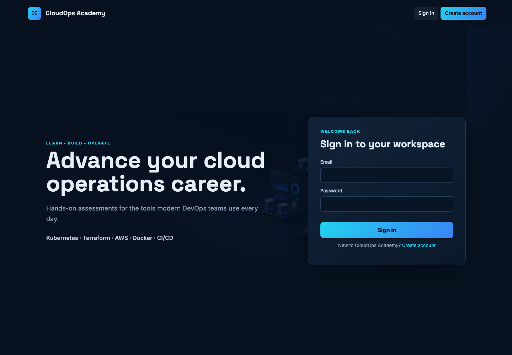
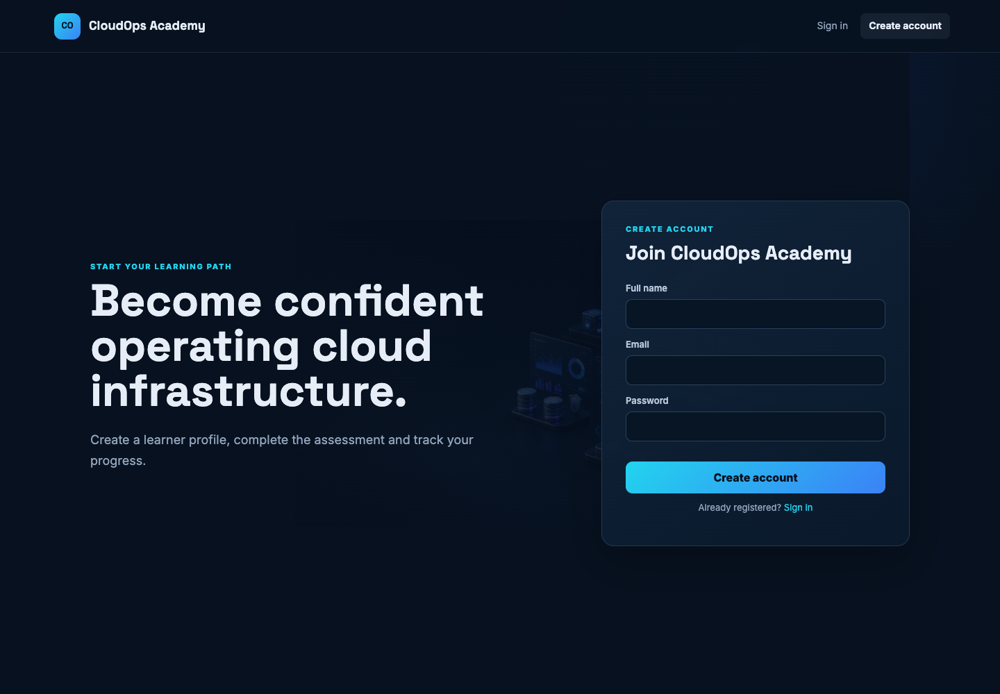
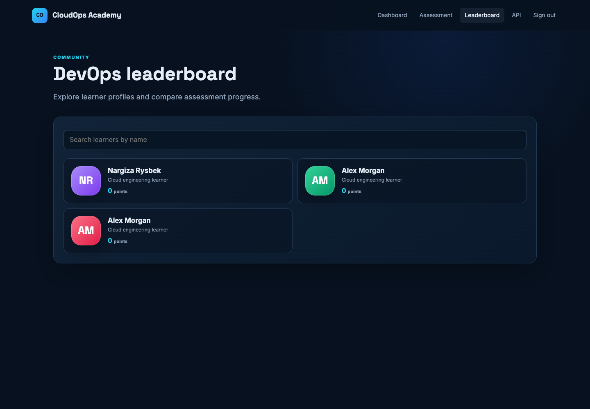
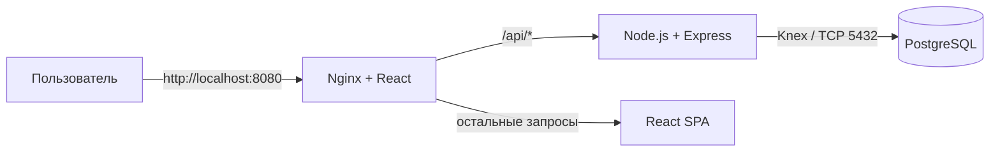
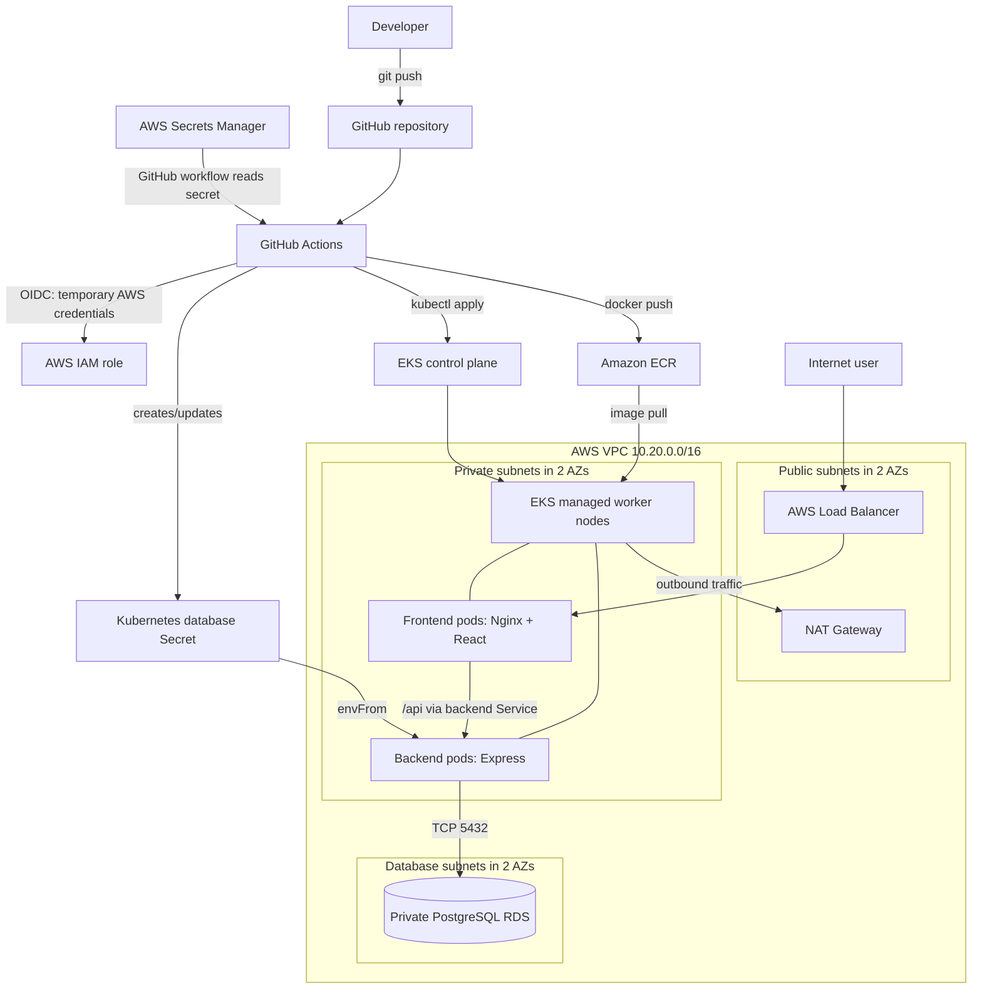

# CloudOps Academy

[Русский](README.md) | [English](README_EN.md)

CloudOps Academy — учебная платформа для проверки практических знаний DevOps и
cloud engineering. Пользователь создаёт профиль, проходит assessment по Docker,
Kubernetes, Terraform, AWS, networking и CI/CD, а результат сохраняется в
PostgreSQL и отображается в общем leaderboard.

Материалы преподавателя:

- [ASSIGNMENT.md](ASSIGNMENT.md) — постановка, acceptance criteria и rubric;
- [TEACHER_GUIDE.md](TEACHER_GUIDE.md) — организация checkpoints и защиты;
- [REFERENCE_SOLUTION.md](REFERENCE_SOLUTION.md) — границы эталонного решения;
- [ASSESSMENT_GUIDE.md](ASSESSMENT_GUIDE.md) — проверка и обратная связь;
- [INFRASTRUCTURE.md](INFRASTRUCTURE.md) — запуск AWS-инфраструктуры.

## Возможности

- регистрация и вход по email и паролю;
- профессиональный профиль с initials-аватаром;
- DevOps assessment из 10 вопросов;
- сохранение результата в PostgreSQL;
- список пользователей и поиск по имени;
- просмотр отдельного профиля;
- Swagger UI с документацией REST API;
- локальный запуск всего приложения через Docker Compose;
- развёртывание в AWS EKS через Terraform и GitHub Actions.

## Quick Start на localhost

1. Запустите Docker Desktop.
2. В Terminal выполните:

```bash
cd ~/Desktop/Dev-2026/cloudops-academy
open -a Docker
docker compose up --build -d
```

3. Дождитесь запуска containers и откройте:

- **Приложение:** <http://localhost:8080>
- **Swagger API:** <http://localhost:8080/api/api-docs>
- **Backend healthcheck:** <http://localhost:8080/api/health>

Проверить состояние:

```bash
docker compose ps
```

Остановить приложение:

```bash
docker compose down
```

Полная инструкция по установке Git и Docker Desktop находится в разделе
[Локальный запуск через Docker Compose](#локальный-запуск-через-docker-compose).

## Как выглядит приложение


Интерфейс использует профессиональную dark cloud-operations тему. Dashboard,
assessment, leaderboard и профили построены без cat-маскотов и внешних avatar
API. Инициалы и цвет профиля формируются локально из имени и ID пользователя.

### Вход и регистрация

| Sign in | Create account |
| --- | --- |
|  |  |

### Dashboard

После входа студент видит учебный track, текущий assessment score и основные
темы программы.


### DevOps assessment

Assessment содержит 10 вопросов по Docker, Kubernetes, Terraform, AWS,
networking, IAM/OIDC и CI/CD.


### Leaderboard

Leaderboard показывает зарегистрированных студентов, их initials-аватары и
последний результат assessment.



### Swagger API documentation


## Технологический стек

| Часть | Технологии | Назначение |
| --- | --- | --- |
| Frontend | React 18, React DOM, custom responsive CSS | Dashboard, формы, leaderboard и assessment |
| Web server | Nginx | Раздаёт React build и проксирует `/api` в backend |
| Backend | Node.js, Express, Knex | REST API и работа с данными |
| Authentication | bcrypt-nodejs | Хеширование и проверка паролей |
| Database | PostgreSQL 16 | Пользователи, данные входа и результаты |
| API docs | Swagger/OpenAPI | Интерактивная документация API |
| Containers | Docker, Docker Compose | Одинаковый локальный запуск всех компонентов |
| Cloud | AWS VPC, EKS, ECR, RDS, Secrets Manager | Production-like инфраструктура |
| Infrastructure as Code | Terraform | Создание и изменение AWS-ресурсов |
| CI/CD | GitHub Actions, GitHub OIDC | Проверка Terraform, сборка образов и деплой |
| Orchestration | Kubernetes | Запуск frontend/backend в EKS |

## Как всё работает вместе



1. Браузер открывает frontend через Nginx.
2. React отображает страницы и отправляет запросы на относительные адреса
   `/api/register`, `/api/signin`, `/api/all` и `/api/score`.
3. Nginx перенаправляет запросы `/api/*` в Express backend.
4. Backend через Knex читает и изменяет данные PostgreSQL.
5. Пароли сохраняются в таблице `login` только в виде bcrypt-хеша. Профиль и
   результат хранятся в таблице `users`.
6. Initials-аватар формируется frontend без запроса во внешний сервис.

Основные API endpoints:

| Method | Endpoint | Назначение |
| --- | --- | --- |
| `GET` | `/` | Проверка backend |
| `GET` | `/health` | Проверка backend и соединения с БД |
| `POST` | `/register` | Регистрация |
| `POST` | `/signin` | Вход |
| `GET` | `/all` | Все пользователи |
| `GET` | `/all/:id` | Один пользователь |
| `GET` | `/profile/:id` | Профиль |
| `PUT` | `/score` | Обновление результата |
| `GET` | `/api-docs` | Swagger UI |

## Локальный запуск через Docker Compose

### Что нужно установить

Для обычного запуска приложения Node.js, npm, PostgreSQL и Terraform локально
устанавливать не нужно — они находятся внутри Docker containers.

Установите только:

1. **Git** — для клонирования репозитория. На macOS можно выполнить
   `xcode-select --install` или установить Git через Homebrew:

   ```bash
   brew install git
   ```

   Официальная инструкция: [Install Git on macOS](https://git-scm.com/install/mac).

2. **Docker Desktop** — включает Docker Engine, Docker CLI и Docker Compose.
   Выберите версию для Apple Silicon или Intel и завершите установку:
   [Install Docker Desktop on Mac](https://docs.docker.com/desktop/setup/install/mac-install/).

3. **Опционально: VS Code** — только для просмотра и редактирования кода.

Проверьте установку:

```bash
git --version
docker --version
docker compose version
```

### 1. Клонировать проект

Через SSH:

```bash
git clone git@github.com:nrysbek-git/capstone-project.git
cd capstone-project
```

Или через HTTPS:

```bash
git clone https://github.com/nrysbek-git/capstone-project.git
cd capstone-project
```

### 2. Запустить Docker Desktop

На macOS Docker Desktop можно открыть командой:

```bash
open -a Docker
```

Дождитесь статуса **Engine running**, затем проверьте daemon:

```bash
docker info
```

Если команда показывает раздел `Server`, Docker готов.

### 3. Собрать и запустить приложение

```bash
docker compose up --build
```

Чтобы оставить containers в background:

```bash
docker compose up --build -d
```

После запуска доступны:

- приложение: <http://localhost:8080>;
- Swagger API: <http://localhost:8080/api/api-docs>;
- проверка backend: <http://localhost:8080/api/health>.

Успешный healthcheck возвращает:

```json
{"status":"ok"}
```

Первый build может занять несколько минут. Docker Compose автоматически:

1. запускает PostgreSQL;
2. создаёт таблицы из `database/init.sql`;
3. запускает backend после готовности базы;
4. запускает frontend после готовности backend.

### 4. Проверить containers и logs

```bash
docker compose ps
docker compose logs -f
```

В `docker compose ps` database и backend должны иметь status `healthy`, а у
frontend должен отображаться port `0.0.0.0:8080->8080/tcp`.

Логи отдельного компонента:

```bash
docker compose logs -f frontend
docker compose logs -f backend
docker compose logs -f database
```

### 5. Остановить приложение

```bash
docker compose down
```

Containers и network будут удалены, но PostgreSQL volume сохранится. Поэтому
пользователи и assessment scores останутся для следующего запуска.

### Полностью очистить локальную базу

Следующая команда удаляет containers и PostgreSQL volume вместе со всеми
локальными пользователями и результатами:

```bash
docker compose down --volumes
```

После этого создайте чистое окружение:

```bash
docker compose up --build -d
```

> Значения PostgreSQL из `docker-compose.yml` предназначены только для
> localhost. Не используйте их в AWS или другом публичном окружении.

### Частые ошибки localhost

#### Cannot connect to the Docker daemon

Docker Desktop не запущен. Выполните:

```bash
open -a Docker
docker info
```

#### Port 8080 is already allocated

Проверьте, кто использует port:

```bash
lsof -i :8080
```

Остановите старый Compose stack или измените левую часть port mapping в
`docker-compose.yml`, например на `8081:8080`. Тогда сайт будет доступен на
`http://localhost:8081`.

#### Frontend открылся, но API недоступен

```bash
docker compose ps
docker compose logs backend
curl http://localhost:8080/api/health
```

#### Нужно пересобрать всё без Docker cache

```bash
docker compose build --no-cache
docker compose up -d
```

## Структура репозитория

```text
.
├── .github/workflows/        # Terraform и application deployment
├── backend/                  # Express REST API
├── frontend/                 # React UI и Nginx
├── database/                 # Локальная схема PostgreSQL
├── kubernetes/               # Deployments, Services и init Job
├── terraform/                # VPC, EKS, ECR, RDS, IAM и Secrets Manager
├── docker-compose.yml        # Локальный full-stack запуск
├── INFRASTRUCTURE.md         # Подробности AWS bootstrap
└── README.md
```

## DevOps-часть проекта

Этот раздел объясняет не только команды, но и зачем нужен каждый слой
инфраструктуры. Приложение используется как workload, вокруг которого построен
полный путь: **код → image → registry → Kubernetes → database → пользователь**.

### Два окружения: localhost и AWS

| Задача | Локально | В AWS |
| --- | --- | --- |
| Запуск контейнеров | Docker Compose | Kubernetes в EKS |
| Frontend | Nginx container, порт `8080` | Deployment + LoadBalancer Service |
| Backend | Express container во внутренней Compose-сети | Deployment + ClusterIP Service |
| Database | PostgreSQL container + volume | Private Amazon RDS PostgreSQL |
| Container registry | Локальный Docker cache | Amazon ECR |
| Секреты | Compose environment для учебного запуска | AWS Secrets Manager + Kubernetes Secret |
| Создание инфраструктуры | Не требуется | Terraform |
| Автоматизация | Ручная команда `docker compose` | GitHub Actions |

Docker image один и тот же по смыслу в любом окружении. Меняются только способ
запуска, сеть, credentials и масштабирование. Это основная идея контейнеризации:
собирать приложение один раз и запускать предсказуемо в разных средах.

### Полная AWS-архитектура



### Сетевой слой: VPC и subnets

Terraform использует официальный модуль `terraform-aws-modules/vpc/aws` и
создаёт сеть в двух Availability Zones:

- **public subnets** имеют маршрут в Internet Gateway и используются внешним
  AWS Load Balancer;
- **private subnets** содержат EKS worker nodes. Nodes могут выйти в интернет
  через NAT Gateway, но входящее соединение напрямую из интернета к ним не идёт;
- **database subnets** используются RDS и не предназначены для публичного
  доступа;
- для `dev` создаётся один NAT Gateway для экономии, а логика `prod` допускает
  отдельный NAT Gateway на каждую AZ для большей отказоустойчивости;
- Kubernetes subnet tags помогают AWS определить, где создавать public и
  internal load balancers.

Путь production-запроса:

```text
Internet
  → AWS Load Balancer
  → frontend Service
  → frontend Pod / Nginx
  → backend Service (только для /api/*)
  → backend Pod / Express
  → private RDS PostgreSQL
```

RDS имеет `publicly_accessible = false`. Его Security Group разрешает порт
`5432` только от Security Group EKS nodes, а не от `0.0.0.0/0`.

### EKS и Kubernetes

Terraform создаёт EKS control plane и managed node group:

- EC2 instance type: `t3.medium`;
- minimum: 1 node;
- desired: 2 nodes;
- maximum: 3 nodes;
- nodes находятся в private subnets;
- доступ GitHub Actions к Kubernetes выдаётся через EKS access entry.

Манифесты из каталога `kubernetes/` создают:

| Объект | Что делает |
| --- | --- |
| Namespace `cloudops-academy` | Изолирует ресурсы приложения |
| Backend Deployment | Запускает две replicas Express API |
| Backend ClusterIP Service | Даёт backend стабильное DNS-имя `backend` внутри cluster |
| Frontend Deployment | Запускает две replicas Nginx/React |
| Frontend LoadBalancer Service | Создаёт внешний AWS load balancer |
| Database Secret | Передаёт `PGHOST`, `PGUSER`, `PGDATABASE`, `PGPASSWORD` backend pods |
| Database init Job | Создаёт таблицы перед application rollout |

Readiness probe не отправляет трафик в backend, пока `/health` не подтвердит
доступность PostgreSQL. Liveness probe позволяет Kubernetes перезапустить
зависший container. `resources.requests` помогают scheduler выбрать node, а
`resources.limits` ограничивают потребление CPU и памяти.

Полезные команды после подключения к cluster:

```bash
kubectl -n cloudops-academy get all
kubectl -n cloudops-academy get pods -o wide
kubectl -n cloudops-academy get service frontend
kubectl -n cloudops-academy logs deployment/backend --tail=100
kubectl -n cloudops-academy describe pod POD_NAME
kubectl -n cloudops-academy rollout status deployment/backend
```

### Docker и ECR

Frontend использует multi-stage build:

1. Node.js устанавливает зависимости и выполняет `npm run build`;
2. в final image копируется только статический React build;
3. Nginx раздаёт файлы и проксирует `/api/*` в Service `backend`.

Backend image содержит Node.js production dependencies, `server.js` и
controllers. Процесс запускается непривилегированным пользователем `node`.

Amazon ECR содержит два отдельных repository:

```text
cloudops-academy-dev-frontend
cloudops-academy-dev-backend
```

Каждый image получает immutable по смыслу tag с полным Git commit SHA. Поэтому
можно определить, какой commit запущен в cluster. ECR включает scan on push и
lifecycle policy, которая хранит последние 20 images.

### Terraform: что он создаёт и как хранит состояние

Код находится в `terraform/`:

| Файл | Ответственность |
| --- | --- |
| `versions.tf` | Версии Terraform и providers |
| `variables.tf` | Входные параметры environment, region, network и GitHub |
| `main.tf` | VPC, EKS, ECR и lifecycle policy |
| `rds.tf` | Password generation, Security Group, RDS и Secrets Manager |
| `github-oidc.tf` | GitHub OIDC provider и IAM role |
| `outputs.tf` | Cluster name, ECR URLs, secret ARN и role ARN |
| `backend.tf` | Remote S3 backend для Terraform state |

Terraform строит dependency graph автоматически. Например, RDS ждёт database
subnet group из VPC, EKS ждёт VPC/private subnets, а database Security Group
ссылается на EKS node Security Group.

Terraform state хранится не в Git, а в зашифрованном S3 bucket:

```text
s3://TF_STATE_BUCKET/cloudops-academy/dev/terraform.tfstate
```

Параметр `use_lockfile=true` включает S3 state locking и защищает от двух
одновременных `apply`. Файлы `*.tfstate`, `terraform.tfvars` и `backend.hcl`
исключены из Git, потому что state может содержать sensitive values.

Основной Terraform workflow:

```text
terraform init
  → terraform fmt -check
  → terraform validate
  → terraform plan
  → terraform apply (только ручной запуск с apply=true)
```

`plan` показывает предполагаемые изменения, но не меняет AWS. `apply` создаёт
или изменяет реальные ресурсы. Не запускайте `apply`, не прочитав plan.

### Secrets и GitHub OIDC

Постоянные `AWS_ACCESS_KEY_ID` и `AWS_SECRET_ACCESS_KEY` в GitHub не нужны.
Workflow запрашивает GitHub OIDC token, AWS проверяет repository/branch в trust
policy и выдаёт короткоживущие credentials для IAM role.

Database password:

1. генерируется provider `random`;
2. передаётся RDS;
3. сохраняется в AWS Secrets Manager как `cloudops-academy-dev/database`;
4. deploy workflow читает secret;
5. workflow создаёт Kubernetes Secret `database`;
6. backend получает значения через `envFrom`.

Не выводите secret через `terraform output`, `echo`, Actions logs или
`kubectl get secret -o yaml`. Terraform state тоже должен считаться секретным.

> Учебное ограничение: текущая GitHub Actions role имеет AWS managed policy
> `AdministratorAccess`, а EKS access entry — cluster admin. Для production
> разделите Terraform и deployment roles и замените их least-privilege
> policies.

## CI/CD в GitHub Actions

### Workflow 1: Terraform

Файл: `.github/workflows/terraform.yml`.

Запускается при изменениях `terraform/**`:

- на pull request — format, validate и plan;
- на push в `main` — format, validate и plan;
- вручную через Actions — те же проверки и, если выбран `apply=true`, apply.

`concurrency: terraform-dev` не позволяет двум инфраструктурным workflow менять
одно окружение одновременно.

### Workflow 2: Build and deploy

Файл: `.github/workflows/deploy.yml`.

Запускается при push в `main`, если изменились frontend, backend, Kubernetes
manifests или сам workflow:

1. получает временные AWS credentials через OIDC;
2. авторизуется в ECR;
3. собирает frontend/backend images;
4. помечает images значением `${{ github.sha }}`;
5. отправляет images в ECR;
6. обновляет локальный kubeconfig для EKS;
7. синхронизирует database credentials в Kubernetes Secret;
8. запускает database initialization Job;
9. подставляет ECR image URLs в manifests;
10. выполняет `kubectl apply`;
11. ждёт успешного rollout двух Deployments.

Если rollout не завершился за 180 секунд, job завершается с ошибкой, а GitHub
Actions показывает проблемный step.

## Первый запуск инфраструктуры

### Требования

- AWS account и локально настроенный AWS CLI;
- Terraform `>= 1.7`;
- `kubectl`;
- Docker Desktop;
- GitHub repository с branch `main`.

### 1. Создать S3 bucket для state

S3 backend должен существовать до `terraform init`, поэтому это bootstrap-шаг.
Имя bucket должно быть глобально уникальным:

```bash
aws s3api create-bucket \
  --bucket YOUR_UNIQUE_TF_STATE_BUCKET \
  --region us-east-1

aws s3api put-bucket-versioning \
  --bucket YOUR_UNIQUE_TF_STATE_BUCKET \
  --versioning-configuration Status=Enabled

aws s3api put-bucket-encryption \
  --bucket YOUR_UNIQUE_TF_STATE_BUCKET \
  --server-side-encryption-configuration \
  '{"Rules":[{"ApplyServerSideEncryptionByDefault":{"SSEAlgorithm":"AES256"}}]}'
```

### 2. Подготовить локальные параметры

```bash
cp terraform/backend.hcl.example terraform/backend.hcl
cp terraform/terraform.tfvars.example terraform/terraform.tfvars
```

В `backend.hcl` укажите S3 bucket. В `terraform.tfvars` укажите:

```hcl
github_repository = "nrysbek-git/capstone-project"
github_branch     = "main"
aws_region        = "us-east-1"
```

### 3. Выполнить первый Terraform apply локально

Первый apply создаёт OIDC provider и IAM role, которую затем будет использовать
GitHub Actions. Поэтому самый первый запуск нельзя делегировать ещё не созданной
role:

```bash
terraform -chdir=terraform init -backend-config=backend.hcl
terraform -chdir=terraform fmt -check -recursive
terraform -chdir=terraform validate
terraform -chdir=terraform plan -out=tfplan
terraform -chdir=terraform apply tfplan
```

Получите необходимые outputs:

```bash
terraform -chdir=terraform output cluster_name
terraform -chdir=terraform output github_actions_role_arn
terraform -chdir=terraform output ecr_repository_urls
```

### 4. Настроить GitHub repository variables

Откройте `Settings → Secrets and variables → Actions → Variables` и создайте:

| Variable | Пример значения |
| --- | --- |
| `AWS_REGION` | `us-east-1` |
| `AWS_ROLE_ARN` | Значение output `github_actions_role_arn` |
| `TF_STATE_BUCKET` | Имя созданного S3 bucket |

После этого вручную запустите workflow **Build and deploy**. External address
появится не сразу:

```bash
aws eks update-kubeconfig --name cloudops-academy-dev --region us-east-1
kubectl -n cloudops-academy get service frontend --watch
```

## Диагностика

### GitHub Actions не получает AWS credentials

Проверьте:

- точность `AWS_ROLE_ARN` и `AWS_REGION`;
- значение `github_repository` без `https://` и `.git`;
- что workflow запущен из разрешённого branch/repository;
- trust policy IAM role;
- permission `id-token: write` в workflow.

### Pods не запускаются

```bash
kubectl -n cloudops-academy get pods
kubectl -n cloudops-academy describe pod POD_NAME
kubectl -n cloudops-academy get events --sort-by=.lastTimestamp
```

Частые причины: неправильный image URL, отсутствие ECR permissions, нехватка
ресурсов на nodes или отсутствующий Kubernetes Secret.

### Backend не подключается к RDS

```bash
kubectl -n cloudops-academy logs deployment/backend --tail=200
kubectl -n cloudops-academy get secret database
kubectl -n cloudops-academy get job database-init
kubectl -n cloudops-academy logs job/database-init
```

Проверьте RDS status, Security Group, port `5432`, secret name и переменные
`PGHOST`, `PGDATABASE`, `PGUSER`, `PGPASSWORD`.

### Load Balancer остаётся Pending

```bash
kubectl -n cloudops-academy describe service frontend
kubectl -n cloudops-academy get events --sort-by=.lastTimestamp
```

Проверьте public subnet tags, AWS permissions и доступность EKS nodes.

## Стоимость и удаление AWS-ресурсов

EKS control plane, EC2 nodes, NAT Gateway, public IPv4, Load Balancer и RDS могут
начислять оплату даже без трафика. После практики удалите workload и
инфраструктуру:

```bash
kubectl delete namespace cloudops-academy
terraform -chdir=terraform plan -destroy -out=destroy.tfplan
terraform -chdir=terraform apply destroy.tfplan
```

Сначала прочитайте destroy plan. S3 state bucket является bootstrap-ресурсом и
этим Terraform configuration не управляется, поэтому при необходимости его
нужно очистить и удалить отдельно.

Перед AWS-развёртыванием также прочитайте
[INFRASTRUCTURE.md](INFRASTRUCTURE.md).

## Важные ограничения

Новый frontend, дизайн и DevOps-инфраструктура уже обновлены: используются React
18, Node.js 20, PostgreSQL 16, новый Docker Compose, Terraform, EKS, ECR,
Kubernetes и GitHub Actions с OIDC.

Однако backend был унаследован от исходного учебного приложения. В нём пока
остались старые библиотеки (`bcrypt-nodejs 0.0.3`, `Knex 0.95`, ранняя версия
Express 4), а установленный `jsonwebtoken` фактически не используется. Вход
возвращает данные пользователя, но не создаёт защищённую JWT/session. Поэтому
сейчас приложение подходит для localhost, обучения и DevOps demo, но не для
хранения реальных пользовательских данных в production.

Следующий этап hardening перед production:

- заменить `bcrypt-nodejs` на поддерживаемый `bcrypt` или `bcryptjs`;
- обновить backend dependencies и добавить lockfile;
- реализовать JWT или server-side sessions и защитить приватные endpoints;
- добавить request validation, rate limiting и security headers;
- заменить init SQL на версионируемые database migrations;
- добавить backend integration/security tests;
- настроить domain, TLS certificate, HTTPS ingress и observability;
- заменить широкую IAM policy GitHub Actions на least-privilege roles.
