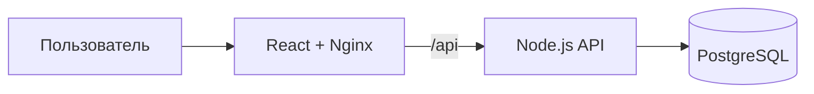
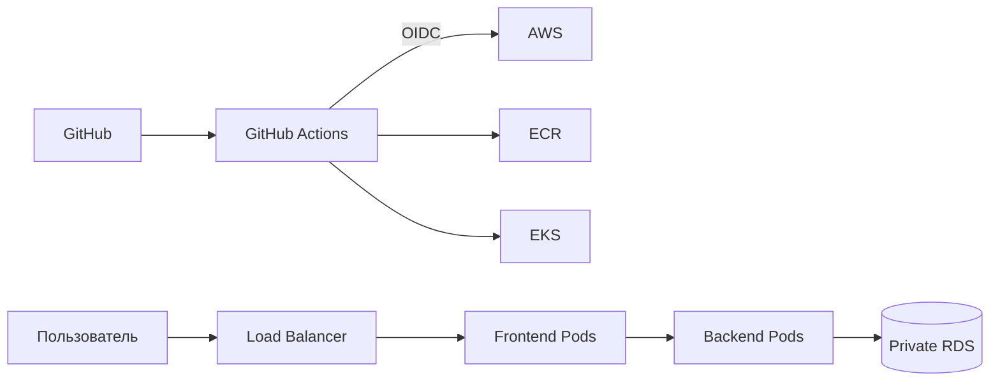

# BookingKG — DevOps Capstone

BookingKG — сервис бронирования путешествий по Кыргызстану и итоговый проект
по Docker, Kubernetes, Terraform, AWS и CI/CD.

## Возможности приложения

- регистрация, вход и JWT-сессия;
- каталог и поиск по 12 направлениям;
- избранное и проверка доступности дат;
- дополнительные услуги и промокод `NOMAD10`;
- создание, просмотр и отмена бронирования;
- электронный ваучер.

## Технологии

| Уровень | Технологии |
| --- | --- |
| Frontend | React 18, Nginx |
| Backend | Node.js, Express, Knex, JWT, bcrypt |
| Database | PostgreSQL 16 |
| Containers | Docker, Docker Compose |
| Orchestration | Kubernetes, Amazon EKS |
| AWS | VPC, EKS, ECR, RDS, Secrets Manager |
| IaC и CI/CD | Terraform, GitHub Actions, GitHub OIDC |

## Локальный запуск

```bash
docker compose up --build -d
docker compose ps
curl http://localhost:8080/api/health
```

Откройте <http://localhost:8080>. Для остановки выполните
`docker compose down`.

## Архитектура



Локально компоненты запускаются через Docker Compose. В AWS frontend и backend
работают как Kubernetes Deployments в EKS, образы хранятся в ECR, а backend
подключается к private RDS PostgreSQL.



## Основные API

| Метод | Адрес | Назначение |
| --- | --- | --- |
| `GET` | `/health` | Health check |
| `POST` | `/auth/register` | Регистрация |
| `POST` | `/auth/login` | Вход |
| `GET` | `/destinations` | Каталог |
| `GET` | `/destinations/:id/availability` | Свободные места |
| `GET/POST/DELETE` | `/favorites` | Избранное |
| `GET/POST` | `/bookings` | Бронирования |
| `PATCH` | `/bookings/:id/cancel` | Отмена |

## Документация

- [ASSIGNMENT.md](ASSIGNMENT.md) — задание и acceptance criteria;
- [INFRASTRUCTURE.md](INFRASTRUCTURE.md) — AWS и Terraform;
- [TEACHER_GUIDE.md](TEACHER_GUIDE.md) — checkpoints и защита;
- [REFERENCE_SOLUTION.md](REFERENCE_SOLUTION.md) — эталонная реализация.

После демонстрации платные AWS-ресурсы удаляются через `terraform destroy`.
