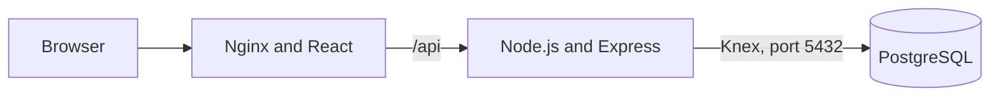
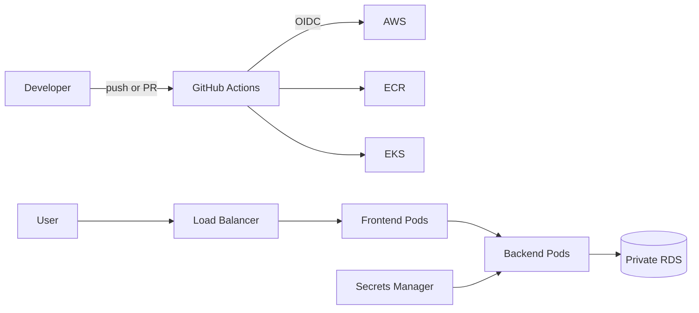

# CloudOps Academy

[Русский](README.md) | [English](README_EN.md)

CloudOps Academy is an educational platform for assessing practical DevOps and
cloud engineering skills. Users create profiles, complete an assessment covering
Docker, Kubernetes, Terraform, AWS, networking, and CI/CD, and save their scores
to a shared PostgreSQL leaderboard.

This repository is the **instructor reference implementation**. Students should
receive the separate `cloudops-capstone-project-starter` repository, which does
not contain ready-made infrastructure.

## Instructor materials

- [ASSIGNMENT.md](ASSIGNMENT.md) — project requirements and acceptance criteria;
- [TEACHER_GUIDE.md](TEACHER_GUIDE.md) — checkpoints and final defense format;
- [REFERENCE_SOLUTION.md](REFERENCE_SOLUTION.md) — reference solution scope;
- [ASSESSMENT_GUIDE.md](ASSESSMENT_GUIDE.md) — assessment and feedback process;
- [INFRASTRUCTURE.md](INFRASTRUCTURE.md) — AWS infrastructure instructions.

## Features

- registration and sign-in;
- student profiles with locally generated avatars;
- a ten-question DevOps assessment;
- PostgreSQL score persistence;
- student search and leaderboard;
- Swagger/OpenAPI documentation;
- local full-stack deployment with Docker Compose;
- AWS deployment with Terraform, EKS, RDS, ECR, and GitHub Actions.

## Application preview


| Sign in | Create account |
| --- | --- |
|  |  |

### Dashboard


### DevOps assessment


### Leaderboard


### API documentation


## Technology stack

| Layer | Technologies | Purpose |
| --- | --- | --- |
| Frontend | React 18, Nginx | User interface and `/api` reverse proxy |
| Backend | Node.js, Express, Knex | REST API and data access |
| Database | PostgreSQL 16 | Users, credentials, and scores |
| Containers | Docker, Docker Compose | Reproducible local environment |
| Cloud | AWS VPC, EKS, ECR, RDS, Secrets Manager | Production-like infrastructure |
| IaC | Terraform | Infrastructure provisioning |
| CI/CD | GitHub Actions, GitHub OIDC | Validation, image builds, and deployment |
| Orchestration | Kubernetes | Application workloads and services |

## Request flow



React sends requests to relative `/api/*` paths. Nginx proxies them to the
backend, while the backend reads and writes PostgreSQL data through Knex.

## Local quick start

### Requirements

Install Git and Docker Desktop. Node.js, npm, and PostgreSQL do not need to be
installed locally for the container-based workflow.

```bash
git clone git@github.com:nrysbek-git/capstone-project.git
cd capstone-project
docker compose up --build -d
docker compose ps
```

Open:

- application: <http://localhost:8080>;
- Swagger UI: <http://localhost:8080/api/api-docs>;
- health check: <http://localhost:8080/api/health>.

Stop the application:

```bash
docker compose down
```

Delete local database data as well:

```bash
docker compose down --volumes
```

## AWS architecture



Terraform provisions networking, private RDS, ECR repositories, EKS, Secrets
Manager, and the GitHub OIDC role. Kubernetes manifests deploy the frontend and
backend. Helm is optional. A custom domain, ExternalDNS, and cert-manager are
optional unless the course provides a student subdomain.

## Security principles

- never commit AWS keys, database passwords, kubeconfig, `.env`, private keys,
  Terraform state, or `terraform.tfvars`;
- keep RDS in private subnets;
- use GitHub OIDC instead of permanent AWS access keys;
- use private ECR repositories;
- use health probes, resource limits, encrypted storage, and least privilege;
- run `terraform destroy` after assessment to avoid unnecessary charges.

## License and educational use

This repository is intended for DevOps education and instructor-led capstone
delivery. Review dependency and security requirements before adapting it for a
real production service.

